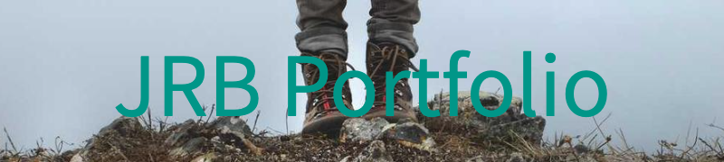
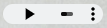
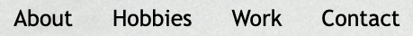
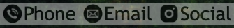
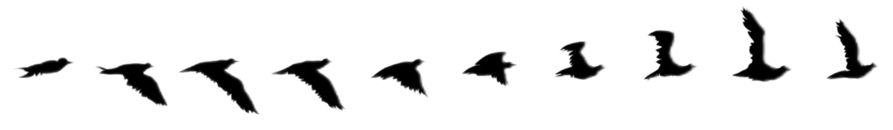

# Junel Balbin: Portfolio

## Description:
* I was not completely prepared to create a professional portfolio yet, so I decided to build my own mockup portfolio instead.  This would give me a chance to practice my new skills I had recently learned in order to build something better in the future.  It was also a perfect opportunity to explore my creativity and right away I knew I wanted to give it an 80's/90's Anime theme and use it to tell a story.

## Installation:
* For best User Experience.  Please have audio ON.  When you have reached the Portfolio page [JRB Portfolio](https://junel-balbin.github.io/BC2-Portfolio/), Click or Press Play button  located on the Upper Left of the Header next to Name.
* On a web browser please follow the link to begin exploring. [JRB Portfolio](https://junel-balbin.github.io/BC2-Portfolio/) 
* Accessible on any mobile device and tablet.

## Usage:
* To use this website. Hover your cursor over the Navigation Header on the upper right and select any of the four options you are interested in.

* Contact Information will be found at the bottom of the page.  You can select Contact on the Navigation Header.

## Contributing:

* Any ideas or feedback is very much appreciated.

## Credits & Resources:
* No Portfolio code template was used in this assignment.  Everything was done by trial and error with hours on end.

* Idea snippets and notes from EdX and UCB.

* A very big Thank You to both Juan Carlos Pleitez & Steven Roberts for the inspiration and sharing their wonderful ideas with the flying bird animation. I was able to learn from their code, use their code and made some changes for it to work on my portfolio.  It was difficult to understand what everything was happening but I am slowly learning and figuring it all out.
[Juan Carlos Pleitez](https://dev.to/hoangdacviet/code-flying-bird-animation-with-css-on-web-app-3oca)
&
[Steven Roberts](https://codepen.io/matchboxhero/pen/RLebOY).

* [Background Image](https://www.pexels.com/photo/aerial-photography-of-a-mountain-2407636/) Provided by Filipino Photographer Jeff Guab. Image of  Mount Mayon Volcano. Located in the Province of Albay, Bicol Region of the Philippines.

* Audio Forest Effects provided by [uppbeat.io](https://uppbeat.io/browse/sfx/forest) and instructions from [w3chools](https://www.w3schools.com/tags/tag_audio.asp). 

* Zoom Image Hover behavior idea from [Stackoverflow](https://stackoverflow.com/questions/40852917/css-enlarging-images-on-hover) and [w3schools](https://www.w3schools.com/howto/howto_css_zoom_hover.asp).

* [Youtube developbyed](https://www.youtube.com/watch?v=Xc6G3oV24yE) HTML Scroll Behavior.

* Style CSS Reset provided by [Eric Meyer](https://meyerweb.com/eric/tools/css/reset/).

* [Banner Maker](https://banner.godori.dev/) Banner for README.

* [About Me Image](https://www.nacion.com/viva/entretenimiento/zapping-el-dia-que-hice-las-paces-con-shinji/OZL6XVX7QVF6FCFMNJZAYHPEX4/story/)
. [Hobbies Image](https://www.geeknewsnow.net/index.php/2023/03/07/anime-fans-need-to-watch-mobile-suit-gundam/).

* [Project 1 Image](https://wallpapercave.com/w/wp9145341)
. [Project 1 Image](https://wallpapercave.com/w/wp10598062).

* [Project 2 Image](https://www.reddit.com/r/wallpaper/comments/k4sjlj/anime_city_street_3840x2160/)
. [Project 2 Image](https://wallpapers.com/wallpapers/cool-aesthetic-japanese-anime-city-o6nokrk4nduiinvx.html).

## License:
* MIT License.